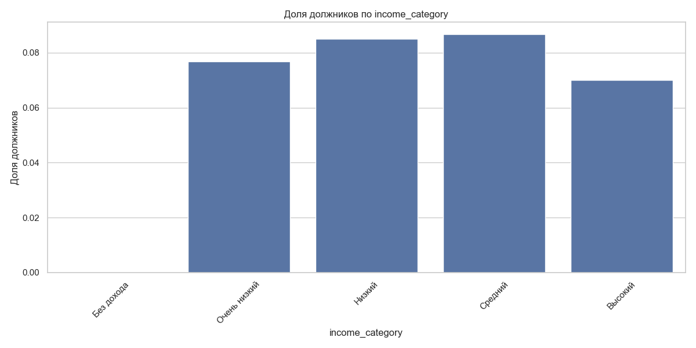
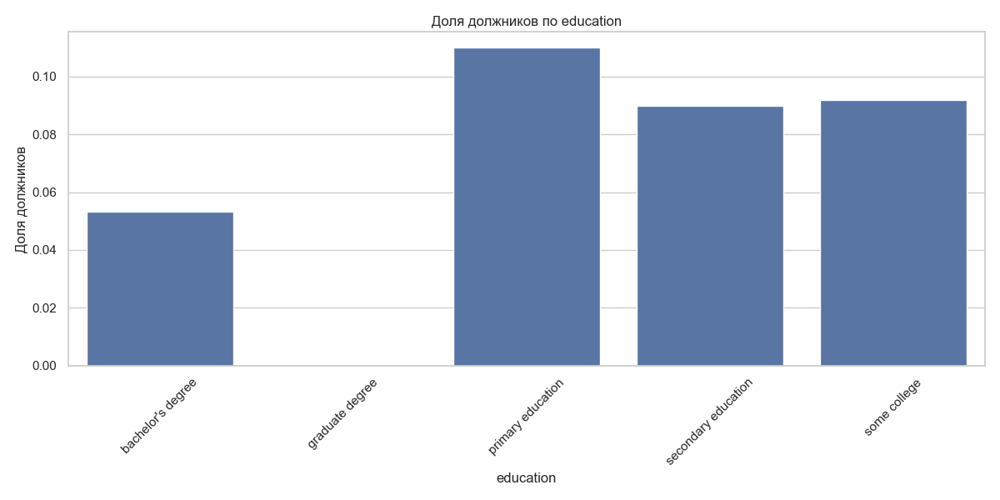
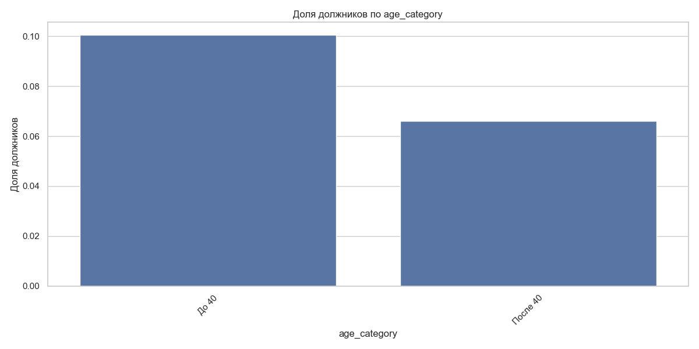
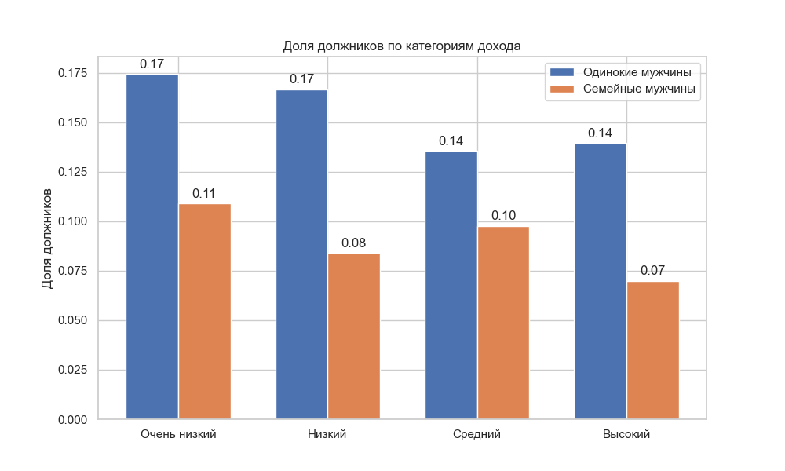

# Исследование надежности заемщиков

## О проекте
Учебный проект по анализу данных для банка "Скрудж", направленный на разработку системы кредитного скоринга. Исследование направлено на выявление факторов, влияющих на возврат кредита в срок. Проект демонстрирует навыки анализа данных для оценки рисков и принятия бизнес-решений.

## Задачи проекта
- Определить ключевые характеристики надежного заемщика
- Выявить факторы риска невозврата кредита
- Предоставить рекомендации для системы кредитного скоринга

## Используемые инструменты и навыки
- Python 3.8+
- pandas
- numpy
- matplotlib
- seaborn
- plotly.express
- Статистический анализ
- Проверка гипотез
- Визуализация данных

## Основные этапы работы
1. Предварительный анализ данных
   - Изучение структуры данных
   - Проверка качества данных
   - Обработка пропусков и аномалий
2. Подготовка данных для анализа
   - Преобразование типов данных
   - Категоризация признаков
   - Обработка дубликатов
3. Исследовательский анализ
   - Анализ распределений признаков
   - Изучение взаимосвязей
   - Выявление паттернов
4. Проверка статистических гипотез
   - О влиянии семейного положения
   - О зависимости от количества детей
   - О связи с уровнем дохода

## Ключевые результаты

### Анализ факторов риска
- Клиенты с низким и средним доходом имеют более высокую долю должников
- Высшее образование связано с меньшей долей должников
- Молодые клиенты (до 40 лет) чаще оказываются должниками
- Наличие 1-2 детей связано с более высокой долей должников

### Проверка гипотез
- Гипотеза о более высокой финансовой ответственности клиентов с детьми не подтвердилась
- Подтверждено, что одинокие мужчины с низким доходом чаще становятся должниками
- Образовательные кредиты показывают более низкий риск невозврата

## 📊 Визуализации

### Анализ по уровню дохода

*Зависимость возврата кредита от уровня дохода*

### Образование и кредитный риск

*Влияние образования на возврат кредита*

### Возрастной анализ

*Распределение должников по возрастным группам*

### Проверка гипотез

*Влияние количества детей на возврат кредита*

*Сравнение возврата кредитов по уровню дохода*

## Структура данных
Проект использует датасет `credit_scoring_eng.csv` со следующими характеристиками:
- `children` — количество детей
- `days_employed` — трудовой стаж
- `dob_years` — возраст
- `education` — уровень образования
- `family_status` — семейное положение
- `gender` — пол
- `income_type` — тип занятости
- `debt` — наличие задолженностей
- `total_income` — ежемесячный доход
- `purpose` — цель кредита

## Как использовать проект
1. Клонировать репозиторий
2. Установить необходимые библиотеки: `pip install -r requirements.txt`
3. Открыть Jupiter Notebook: `Project_2_credit_scoring.ipynb`

## 📝 Структура проекта

credit_scoring_analysis/
│
├── Project_2_credit_scoring.ipynb          # Анализ кредитных рисков
│
├── README.md                               # Документация проекта
│
├── requirements.txt                        # Зависимости проекта
│
└── visualizations/                         # Визуализации проекта
    ├── income_debt_ratio.png              # Анализ влияния дохода на возврат кредита
    ├── education_debt_ratio.png           # Зависимость возврата от образования
    ├── age_debt_ratio.png                 # Распределение должников по возрасту
    ├── children_hypothesis.png            # Анализ влияния наличия детей
    └── men_income_hypothesis.png          # Исследование дохода и пола

<pre>
credit_scoring_analysis/
│
├── Project_2_credit_scoring.ipynb          # Анализ кредитных рисков
│
├── README.md                               # Документация проекта
│
├── requirements.txt                        # Зависимости проекта
│
└── visualizations/                         # Визуализации проекта
    ├── income_debt_ratio.png              # Анализ влияния дохода на возврат кредита
    ├── education_debt_ratio.png           # Зависимость возврата от образования
    ├── age_debt_ratio.png                 # Распределение должников по возрасту
    ├── children_hypothesis.png            # Анализ влияния наличия детей
    └── men_income_hypothesis.png          # Исследование дохода и пола
</pre>

*Примечание: Исходные данные (credit_scoring_eng.csv) не включены в репозиторий в целях конфиденциальности.*

## Disclaimer
Этот проект является учебным и создан в рамках курса "Python для анализа данных". Представлен исключительно в демонстрационных целях как часть портфолио. 

- Проект может содержать материалы, защищенные авторским правом
- Не предназначен для коммерческого использования
- Данные предоставлены в учебных целях
- Использование кода возможно только в образовательных целях

## Автор
[Apashkin Alexandr]

## Благодарности
Благодарю команду Яндекс.Практикума за предоставленные материалы и поддержку в обучении.
