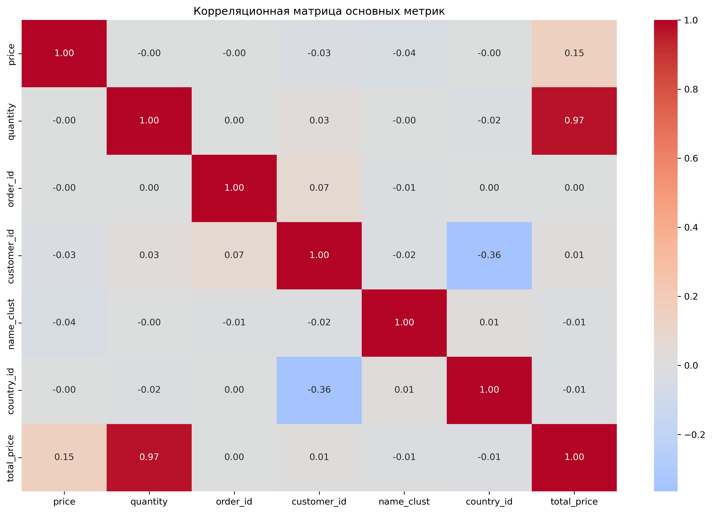
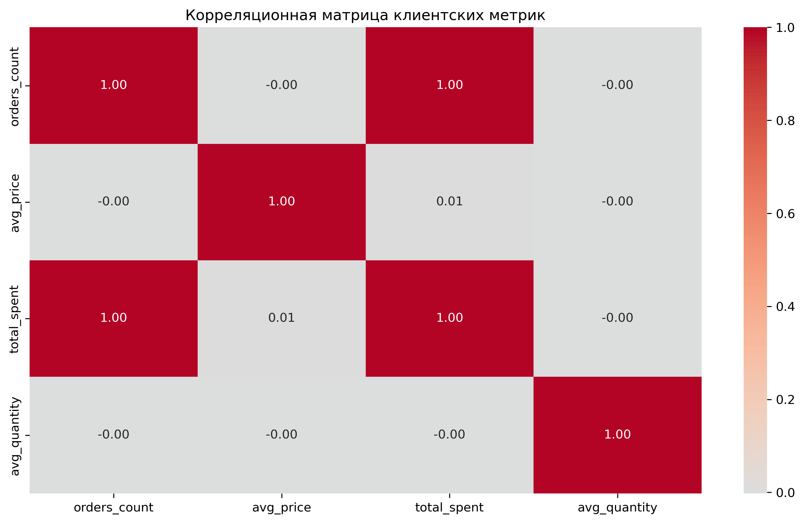
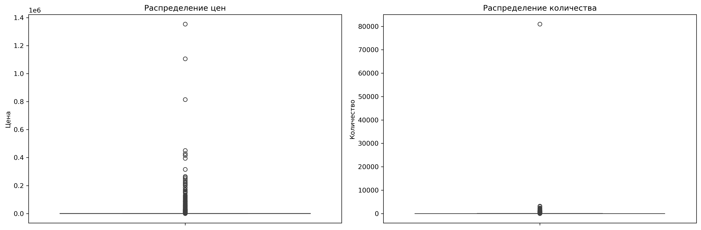
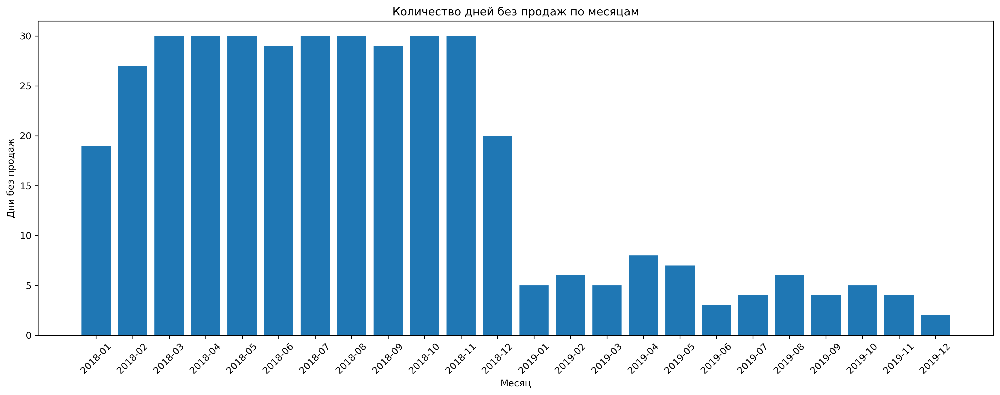
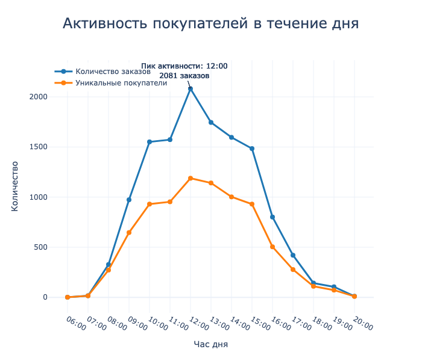
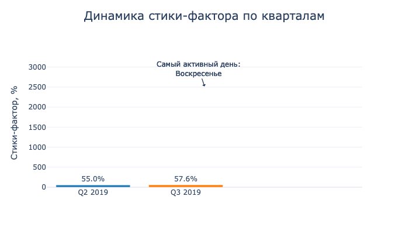

# Анализ данных интернет-магазина "Подарочек"

## О проекте
Учебный проект по анализу данных, выполненный в рамках курса по аналитике данных. Проект демонстрирует навыки работы с данными, проведения статистического анализа и формирования бизнес-рекомендаций на основе полученных результатов.

## Задачи проекта
- Провести комплексный анализ данных интернет-магазина
- Выполнить сегментацию клиентской базы
- Проверить статистические гипотезы
- Сформировать рекомендации по улучшению бизнес-показателей

## Используемые инструменты и навыки
- Python 3.8+
- pandas 2.0.0
- numpy 1.24.0
- matplotlib 3.7.1
- seaborn 0.12.2
- plotly 5.13.0
- scipy 1.10.1
- RFM-анализ
- Проверка статистических гипотез
- Подготовка бизнес-рекомендаций

## Основные этапы работы
1. Подготовка и очистка данных
2. Исследовательский анализ
3. Анализ профилей клиентов
4. RFM-сегментация
5. Проверка статистических гипотез
6. Формирование выводов и рекомендаций

## Ключевые результаты

### Анализ клиентской базы
- Проанализировано поведение 3,554 клиентов
- Выявлен высокий процент возвратных клиентов (59.34%)
- Обнаружен стабильный рост показателя удержания клиентов

### Сегментация клиентов
- VIP-клиенты (6.19%): высокая частота покупок
- Активные клиенты (34.02%): основной драйвер продаж
- Требуют внимания (20.23%): потенциал для реактивации

### Географический анализ
- Выявлены существенные различия в поведении клиентов из разных стран
- Определены наиболее перспективные географические направления
- Предложены стратегии развития для разных регионов

## 📊 Визуализации

### Анализ корреляций

*Корреляционный анализ ключевых метрик*

### Клиентские метрики

*Анализ взаимосвязей клиентских характеристик*

### Распределение цен и количества

*Анализ распределения основных показателей*

### Анализ продаж

*Анализ периодов без продаж*

### Активность клиентов

*Почасовое распределение заказов*

*Распределение заказов по дням недели*

## Структура данных
Проект работает с двумя основными датасетами:

### Основной датасет заказов
- Информация о датах заказов
- Данные о количестве и стоимости товаров
- Идентификаторы клиентов и стран

### Справочник товаров
- Описания товаров
- Категоризация продукции

## 📝 Структура проекта

gift_shop_analysis/
├── Project_3_gift_shop_analysis.ipynb   # Jupyter notebook с анализом
├── visualizations/   # Папка с сохраненными визуализациями
│   ├── correlation_matrix.png           # Корреляционная матрица
│   ├── customer_correlation_matrix.png  # Корреляции клиентских метрик
│   ├── price_quantity_distribution.png  # Распределение цен и количества
│   ├── days_without_sales.png          # Анализ дней без продаж
│   ├── orders_by_hour.png              # Почасовая активность
│   └── orders_by_weekday.png           # Активность по дням недели
├── requirements.txt                     # Зависимости проекта
└── README.md                           # Документация проекта

## Как использовать проект
1. Клонировать репозиторий
2. Установить необходимые библиотеки: `pip install -r requirements.txt`
3. Открыть Jupyter Notebook: `Project_3_gift_shop_analysis.ipynb`

## Disclaimer
Этот проект является учебным и создан в рамках курса "Python для анализа данных". Представлен исключительно в демонстрационных целях как часть портфолио. 

- Проект может содержать материалы, защищенные авторским правом
- Не предназначен для коммерческого использования
- Данные предоставлены в учебных целях
- Использование кода возможно только в образовательных целях

## Автор
[Apashkin Alexandr]

## Благодарности
- Благодарю команду курса за предоставленные материалы и данные
- Отдельная благодарность преподавателям за помощь и ревью
